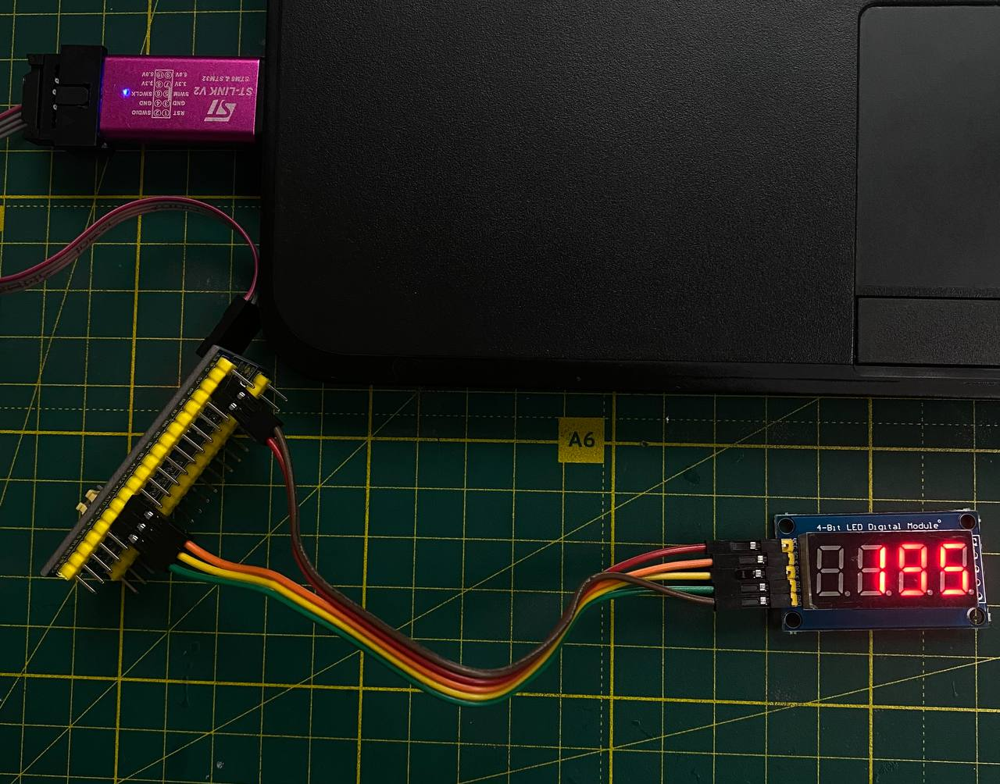

# STM32 library for 4 digits 7 segment indicator with 74HC595 shift register

This library is STM32 implementation of [DIYables_4Digit7Segment_74HC595](https://github.com/DIYables/DIYables_4Digit7Segment_74HC595/) Arduino library. 


## How to use:


1. Configure your `SYS (Debug->Serial Wire)` and `RCC (HSE->Crystal/Ceramic Resonator)`
2. Instead of SPI I use just GPIO pins, because I need SPI for another sensor. So, we need to configure GPIO:
   - Set `PA9`, `PA10`, `PA11` as `GPIO_Output` with `GPIO Pull-down` for each of them.
   - Connect your sensor as: `PA11 - SCLK`, `PA10 - RCLK`, `PA9 - DIO`
3. Copy `LED74HC595.h` to `Inc`, and `LED74HC595.c` to `Src`

4. Include library in code and make LED74HC595 structure

```c
/* Private includes ----------------------------------------------------------*/
/* USER CODE BEGIN Includes */
#include "LED74HC595.h"
/* USER CODE END Includes */

// ... 

/* Private variables ---------------------------------------------------------*/

/* USER CODE BEGIN PV */

// MAKE LED Structure
LED74HC595 ledObj;

/* USER CODE END PV */
// ... 
```

5. Set up library

``` C
// ... 
int main(void)
{
    // ...
    /* USER CODE BEGIN 2 */
    
    // SETTING UP OF LIBRARY
    //               SCLK PIN   SCLK Port   RCLK PIN   RCLK Port   DIO PIN   DIO PORT
    setUp(&ledObj, GPIO_PIN_11,  GPIOA,    GPIO_PIN_10,  GPIOA,   GPIO_PIN_9,  GPIOA);
    
    /* USER CODE END 2 */
```

6. Write your code in `while` block. Print `195` `int` number on display. After printing you need to call `loop();` function.

``` C
    /* Infinite loop */
    /* USER CODE BEGIN WHILE */
    while (1)
    { 
        // PRINT INT NUMBERS
        //         NUMBER  ZERO PADDING
        printInt( 195,     false);
        loop();
        /* USER CODE END WHILE */

        /* USER CODE BEGIN 3 */
    }
    /* USER CODE END 3 */
}
// ... 
```

7. The same way you can print `float` numbers. Instead of `printInt` you need to use `printFloat`

``` C
    /* Infinite loop */
    /* USER CODE BEGIN WHILE */
    while (1)
    { 
        // PRINT FLOAT NUMBERS 3.14
        //         NUMBER   DECIMAL PLACE     ZERO PADDING
        printFloat( 3.14,        2,             false);
        loop();
        /* USER CODE END WHILE */

        /* USER CODE BEGIN 3 */
    }
    /* USER CODE END 3 */
}
// ... 
```

8. Also you can set number at special place, you can use points and some symbols on this display: 
   - `__DASH`  (-)
   - `__UNDERSCORE` ( _ )
   - `__C` (C)
   - `__E` (E)
   - `__F` (F)
   - `__DEGREE` (°)

``` C
    /* Infinite loop */
    /* USER CODE BEGIN WHILE */
    while (1)
    { 
        // PRINT 9.3°C TEMPERATURE
        clear();
	    setNumber(1, 9);              // set 9 at the 1st digit
	    setDot(1);                    // set . at the 1st digit
	    setNumber(2, 3);              // set 3 at the 2nd digit
	    setChar(3, __DEGREE); // set ° at the 3rd digit
	    setChar(4, __C);      // set C at the 3rd digit
	    show();            
        loop();
        /* USER CODE END WHILE */

        /* USER CODE BEGIN 3 */
    }
    /* USER CODE END 3 */
}
// ... 
```
| INT result          | FLOAT result            | Symbols result               |
|---------------------|-------------------------|------------------------------|
|  |  |  |
|                     |                         |                              |
